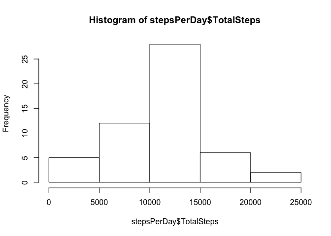
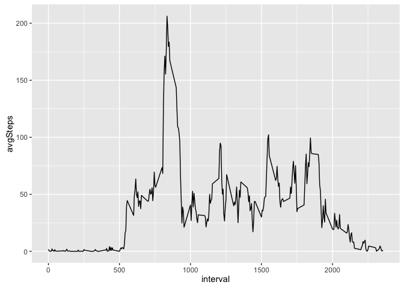
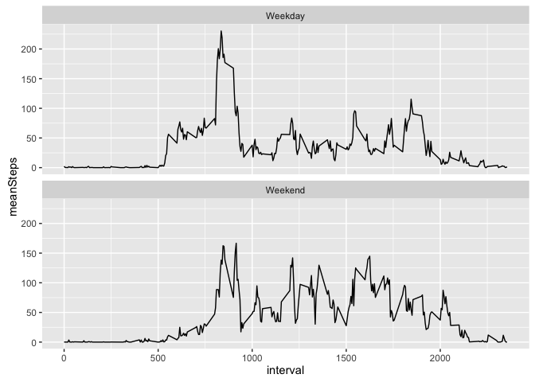

# PA1_template


Initialize libraries and read in data

```r
set.seed(15)
suppressMessages(suppressWarnings(library(tidyverse)))
suppressWarnings(library(stringr))
activityData <- read.csv('activity.csv')
```

Histogram of steps taken each day

```r
stepsPerDay <- activityData %>% 
  group_by(date) %>% 
  summarise(TotalSteps = sum(steps))
hist(stepsPerDay$TotalSteps)
```

<!-- -->

Mean and median of the number of steps taken each day

```r
print(str_c('Mean: ',mean(stepsPerDay$TotalSteps,na.rm = TRUE)))
```

```
## [1] "Mean: 10766.1886792453"
```

```r
print(str_c('Median: ',median(stepsPerDay$TotalSteps,na.rm = TRUE)))
```

```
## [1] "Median: 10765"
```

Time series plot of the number of steps taken

```r
avgIntervalSteps <- activityData %>% 
  group_by(interval) %>% 
  summarise(avgSteps = mean(steps,na.rm = TRUE))
avgIntervalSteps %>% 
  ggplot(aes(interval,avgSteps)) + 
  geom_line()
```

<!-- -->

Highest average step count interal

```r
avgIntervalSteps2 <- avgIntervalSteps %>% 
  arrange(desc(avgSteps))
print(str_c('Highest average step count occurs at interval: ',avgIntervalSteps2$interval[1]))
```

```
## [1] "Highest average step count occurs at interval: 835"
```

Print total NA rows

```r
NARows <- activityData %>% 
  filter(is.na(steps))
print(str_c('Total NA rows: ',nrow(NARows)))
```

```
## [1] "Total NA rows: 2304"
```

Impute missing values using interval mean

```r
imputedActivityData <- activityData %>% 
  left_join(avgIntervalSteps) %>% 
  mutate(steps = ifelse(is.na(steps),avgSteps,steps)) %>% 
  select(-avgSteps)
```

```
## Joining, by = "interval"
```

Histogram of steps taken each day of imputed data set

```r
stepsPerDayImputed <- imputedActivityData %>% 
  group_by(date) %>% 
  summarise(TotalSteps = sum(steps))
hist(stepsPerDay$TotalSteps)
```

<!-- -->

Mean and median of the number of steps taken each day of imputed data set
Median changes very slightly with imputed data

```r
print(str_c('Mean: ',mean(stepsPerDayImputed$TotalSteps,na.rm = TRUE)))
```

```
## [1] "Mean: 10766.1886792453"
```

```r
print(str_c('Median: ',median(stepsPerDayImputed$TotalSteps,na.rm = TRUE)))
```

```
## [1] "Median: 10766.1886792453"
```

Panel plot of weekday vs weekend

```r
weekdayImputedData <- imputedActivityData %>% 
  mutate(Weekday = weekdays(as.Date(as.character(date)))) %>% 
  mutate(Weekday = ifelse(Weekday == 'Saturday' | Weekday == 'Sunday','Weekend','Weekday'))

weekdayImputedData %>% 
  group_by(Weekday,interval) %>% 
  summarise(meanSteps = mean(steps)) %>% 
  ggplot(aes(interval,meanSteps)) +
  geom_line() + 
  facet_wrap(~Weekday,nrow = 2, ncol = 1)
```

<!-- -->

